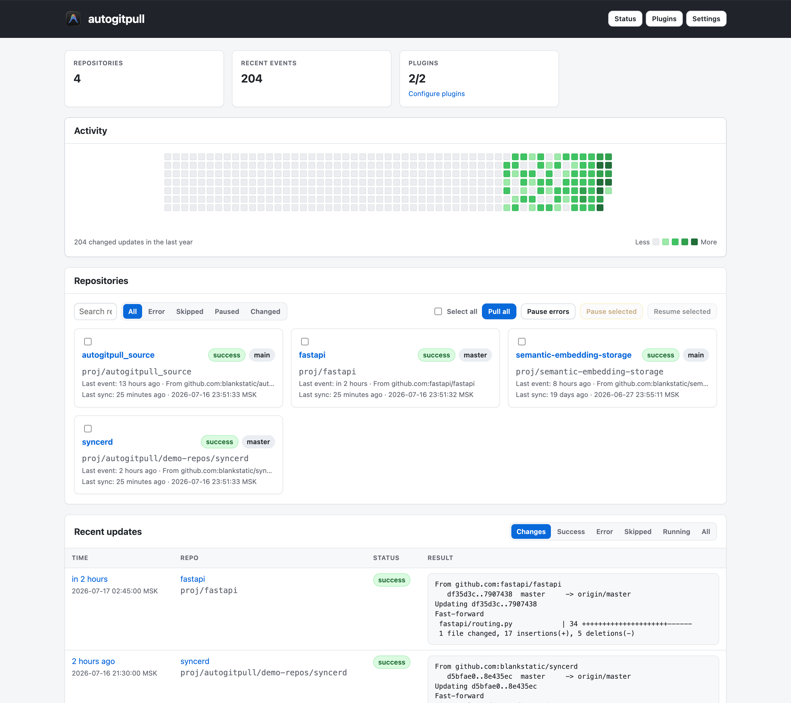
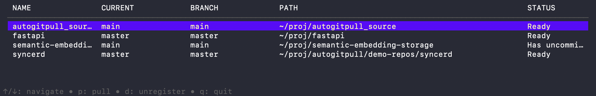
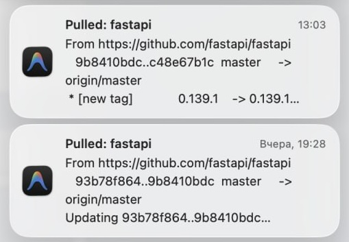

# autogitpull

`autogitpull` safely keeps multiple local Git repositories up to date. Register
repositories once, then use the TUI, local web dashboard, or background daemon
to pull them.

It only pulls a repository when:

- it is on the detected remote default branch;
- its working tree is clean.

Every attempt is recorded in `~/.autogitpull/updates.sqlite`, including skipped
and failed pulls.

## Features

- recursive repository discovery;
- terminal UI and local dashboard at `http://localhost:9009`;
- automatic pulls every 30 minutes;
- bounded concurrent pulls with protection against duplicate in-process pulls;
- update history and per-change details;
- configurable desktop notifications;
- optional AI-generated change summaries through an OpenAI-compatible API;
- macOS `launchd` and Linux user `systemd` services.

## Screenshots

### Web dashboard



### Terminal UI



### Desktop notifications



## Install

### macOS (Apple Silicon)

```sh
bash -c "$(curl -fsSL https://raw.githubusercontent.com/blankstatic/autogitpull/main/tools/install_darwin_arm64.sh)"
```

For richer clickable notifications, install `terminal-notifier` before running
the installer:

```sh
brew install terminal-notifier
```

### Linux (amd64 or arm64)

```sh
bash -c "$(curl -fsSL https://raw.githubusercontent.com/blankstatic/autogitpull/main/tools/install_linux.sh)"
```

Install the binary and start the user service immediately:

```sh
bash -c "$(curl -fsSL https://raw.githubusercontent.com/blankstatic/autogitpull/main/tools/install_linux.sh)" -- --start-service
```

The installers download the latest release to `/usr/local/bin/autogitpull`.
Re-running an installer safely updates the binary and refreshes an existing
service. Set `VERSION=vX.Y.Z` to install a specific release.

### Build from source

Requires Go. From the repository root:

```sh
cd src
go build -o autogitpull .
./autogitpull --help
```

## Quick start

```sh
# Register the current repository
autogitpull register

# Register explicit paths
autogitpull register ~/work/project-a ~/work/project-b

# Find and register repositories recursively
autogitpull discover ~/work

# Open the terminal UI
autogitpull status

# Run automatic pulls and the dashboard in the foreground
autogitpull daemon
```

The dashboard is then available at <http://localhost:9009>.

## Commands

```text
autogitpull register [paths...]     Add repositories; defaults to the current directory.
autogitpull unregister [paths...]   Remove repositories; defaults to the current directory.
autogitpull discover [paths...]     Find Git repositories recursively and register them.
autogitpull status                  Open the terminal UI (also the default command).
autogitpull daemon                  Run auto-pull and the web dashboard.
autogitpull service <command>       Manage the background service.
autogitpull version                 Print the version.
```

Use `-s` or `--silently` to suppress desktop notifications for a command.

TUI keys:

```text
↑/↓  navigate
p    pull the selected repository
d    unregister the selected repository
q    quit
```

## Background service

```sh
autogitpull service install
autogitpull service start
autogitpull service status
autogitpull service stop
autogitpull service uninstall
```

On macOS, logs are written to:

```text
/tmp/com.blankstatic.autogitpull.log
/tmp/com.blankstatic.autogitpull.error.log
```

On Linux, follow logs with:

```sh
journalctl --user -u autogitpull.service -f
```

To keep the Linux user service running after logout:

```sh
sudo loginctl enable-linger "$USER"
```

## Web dashboard

The daemon serves a local web interface with:

- `/` — activity, repositories, updates, and a compact plugin summary;
- `/status` — service, database, and daemon state;
- `/settings` — pull interval and history retention;
- `/plugins` — notification and AI Summary settings;
- `/update?id=<id>` — pull output, plugin diagnostics, and generated summaries.

Bulk pulls start in the background, so the page returns immediately while
progress appears in the update history.

## Plugins

Plugins run after a pull has been saved. By default they run only when the local
revision changed, though individual plugins can opt into no-change events.

### Notifications

The built-in Notifications plugin is enabled by default. It can be configured
and tested on `/plugins`; notification clicks open the related update details.

Linux desktop notifications require a graphical session. The service imports
the current desktop environment into `systemd --user` and uses `notify-send`,
`xdg-open`, D-Bus, or `kdialog` depending on what is available.

### AI Summary

AI Summary is disabled by default. It supports OpenAI-compatible Responses and
Chat Completions APIs and can be configured with a provider name, URL, API key,
model, and prompt.

Summaries use the saved pre-pull and post-pull revisions. Context controls let
you include metadata only or selected code diffs, set file filters and byte
limits, and choose diff context size. Common secret, dependency, build, and lock
files are excluded by default. The exact prompt and input preview are visible on
the update details page.

## Pull behavior

For each registered repository, `autogitpull`:

1. checks the current branch against the stored default branch;
2. checks `git status --porcelain`;
3. runs `git pull origin` only when both safety checks pass;
4. records the result and the revisions before and after the pull;
5. runs enabled plugins from the saved update.

`register` and `discover` require the default branch to be detectable from
`origin/HEAD`. Discovery skips hidden and heavy directories such as `.git`,
`node_modules`, `vendor`, `build`, `dist`, `target`, and common caches.

## Data

Repositories, settings, history, and plugin results are stored in:

```text
~/.autogitpull/updates.sqlite
```

Legacy `~/.autogitpull/config.json` data is migrated automatically.

## Release artifacts

GitHub releases use these asset names:

```text
autogitpull-macos-arm64
autogitpull-linux-amd64
autogitpull-linux-arm64
```
